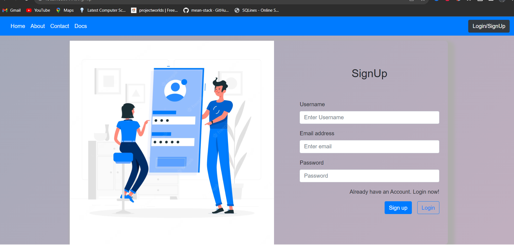
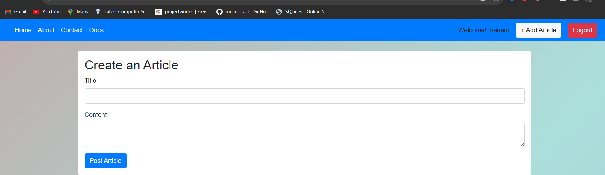
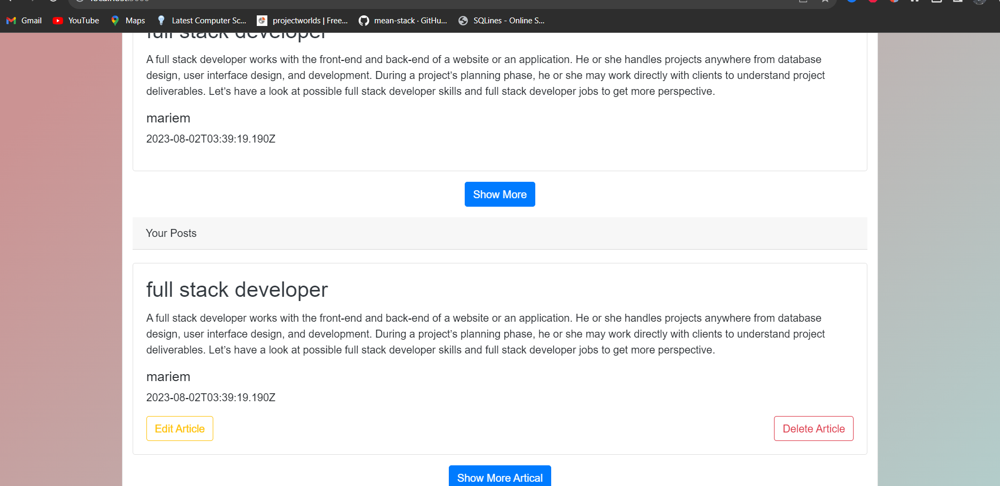
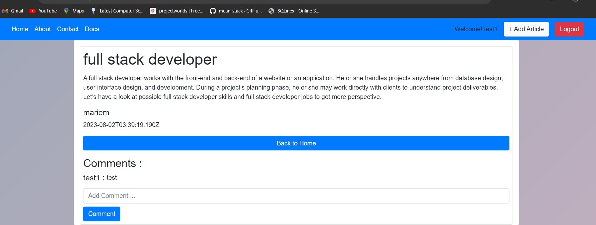
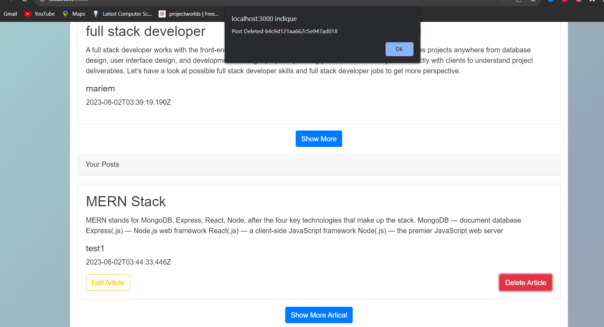

# Challenge-technique
# Challenge-technique

## Installation

- Fork this repo and run the git clone command from your terminal/bash
- Create a `.env` file in the backend directory
- mongoDB_URI - Insert the correct connection URL for your MongoDB database

  `mongodb+srv://<username>:<password>@<username>.fxrpe.mongodb.net/BlogDB?retryWrites=true&w=majority`

- mongoDB_LOCAL - Insert the correct connection URL for your MongoDB database local

  `mongodb://localhost:27017/articalDB`

# Backend

- cd into Backend and write npm install or npm i in command terminal
  $ cd Backend
  $/Backend npm install
  $Backend node server.js
  
# client

- cd into frontend and write npm install or npm i in command terminal
  $ cd frontend
  $/frontend npm install
- Write npm start to start the react server and backend
  $/frontend npm start
  
